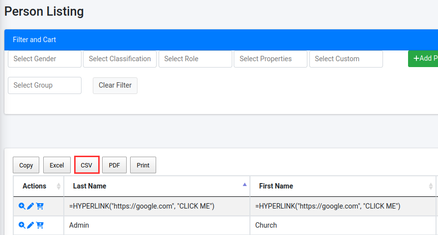
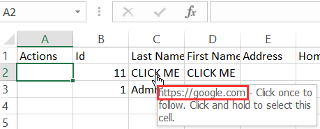

# CVE-2023-25348 - CSV/Formula Injection

|                 |                                                                                      |
| --------------- | --------------- |
| Researchers     | 10splayaSec                                                               |
| Severity        | 5.4 (CVSS:3.1/AV:N/AC:L/PR:L/UI:R/S:C/C:L/I:L/A:N)                                   |
| Published       | https://cve.mitre.org/cgi-bin/cvename.cgi?name=CVE-2023-25348         |
| Software Link   | https://github.com/ChurchCRM/CRM             |

## Description

ChurchCRM 4.5.3 contains a CSV/Formula injection vulnerability via the `Last Name` and `First Name` input fields when creating a new person. These vulnerabilities allow attackers to execute arbitrary code through a crafted Excel file, which could be potentially harmful.

## Proof of Concept

1. Navigate to `/churchcrm/PersonEditor.php` endpoint. Create a user with the `First Name` and `Last Name` being `=HYPERLINK("https://google.com", "CLICK ME")`. Fill out the remainder of the form and click `Save and Add` at the bottom of the webpage.

2. Now, go to `/churchcrm/v2/people`, and click on the CSV button. 

3. Using Microsoft Excel, open the CSV file, and you will see the `CLICK ME` is clickable. Once the user clicks on the `CLICK ME`, they will be redirected to Google.

