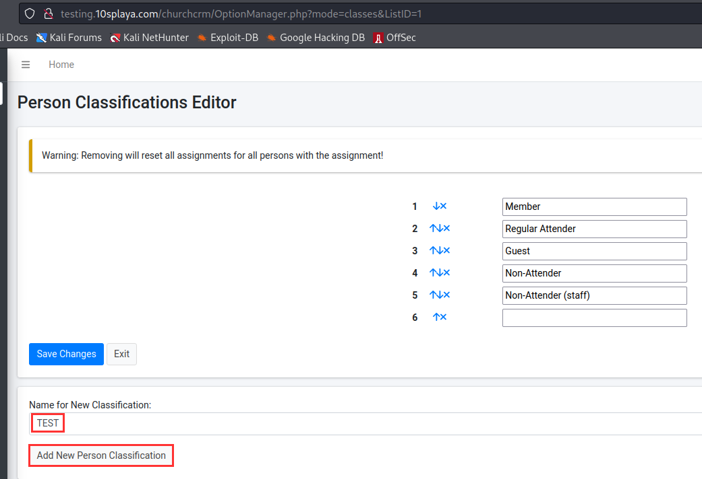
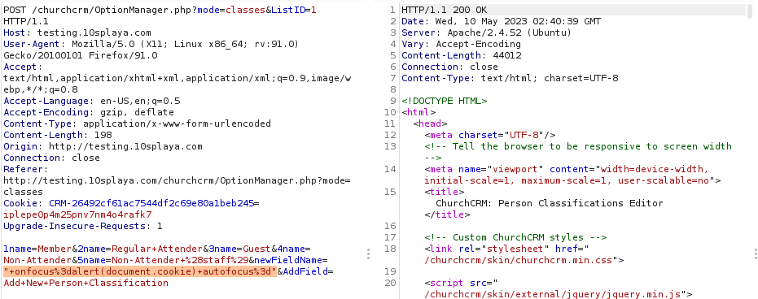
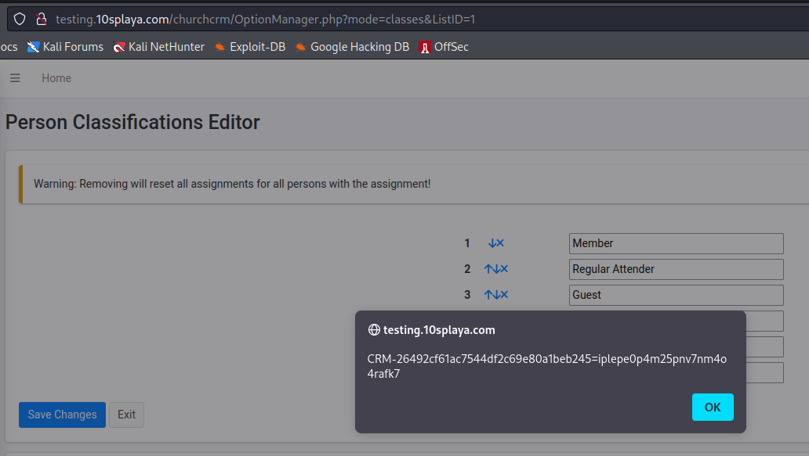

# CVE-2023-26842 - Cross-Site Scripting (Stored)

|                 |                                                                                      |
| --------------- | --------------- |
| Researchers     | 10splayaSec                                                               |
| Severity        | 5.4 (CVSS:3.1/AV:N/AC:L/PR:L/UI:R/S:C/C:L/I:L/A:N)                                   |
| Published       | https://cve.mitre.org/cgi-bin/cvename.cgi?name=CVE-2023-26842         |
| Software Link   | https://github.com/ChurchCRM/CRM             |

## Description

A stored Cross-site scripting (XSS) vulnerability in ChurchCRM 4.5.3 allows remote attackers to inject arbitrary web script or HTML via the OptionManager.php endpoint.

## Proof of Concept

1. Navigate to the `/churchcrm/OptionManager.php?mode=classes` endpoint. Then input something inside the `Name for New Classification` field. Once done, enable a proxy, such as Burp Suite, and click on `Add New Person Classification`.

2. Now, in the intercepted request, put `" onfocus=alert(document.cookie) autofocus="` and send the request.

3. Going back to the browser, we can see the Javascript was successfully executed.

