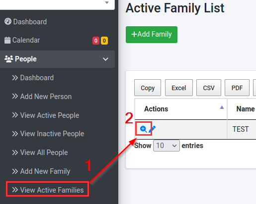
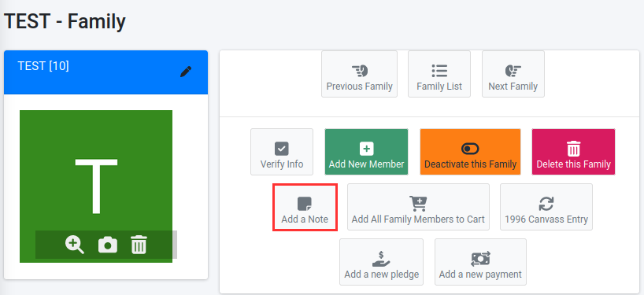

# CVE-2023-26843 - Cross-Site Scripting (Stored) via NoteEditor.php

|                 |                                                                                      |
| --------------- | --------------- |
| Researchers     | 10splayaSec                                                               |
| Severity        | 5.4 (CVSS:3.1/AV:N/AC:L/PR:L/UI:R/S:C/C:L/I:L/A:N)                                   |
| Published       | https://cve.mitre.org/cgi-bin/cvename.cgi?name=CVE-2023-26843         |
| Software Link   | https://github.com/ChurchCRM/CRM             |

## Description

A stored Cross-site scripting (XSS) vulnerability in ChurchCRM 4.5.3 allows remote attackers to inject arbitrary web script or HTML via the NoteEditor.php.

## Proof of Concept

1. On the left sidebar, navigate to the `View Active Families` dropdown and click on the blue icon.

2. Click on `Add a Note`.

3. Click `Source` and type `">` into the text area. Then click `Save`.

4. You will be redirect to the family page, where you will receive a pop-up with the cookie inside an alert box.

*It is important to note that this also works with people as well. Use the following endpoint to use a PersonID*: `/churchcrm/NoteEditor.php?PersonID=<ID>`